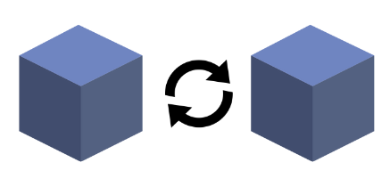
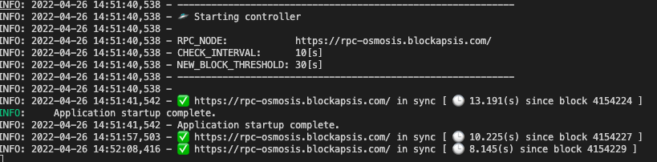

> ⚠️⚠️⚠️⚠️⚠️⚠️⚠️⚠️⚠️⚠️⚠️⚠️⚠️⚠️⚠️⚠️⚠️⚠️⚠️⚠️⚠️⚠️⚠️⚠️⚠️⚠️⚠️⚠️⚠️⚠️⚠️⚠️⚠️⚠️⚠️⚠️⚠️
> 
> Deprecated in favour of https://github.com/osmosis-labs/osmosis-rpc-healthcheck
>
> ⚠️⚠️⚠️⚠️⚠️⚠️⚠️⚠️⚠️⚠️⚠️⚠️⚠️⚠️⚠️⚠️⚠️⚠️⚠️⚠️⚠️⚠️⚠️⚠️⚠️⚠️⚠️⚠️⚠️⚠️⚠️⚠️⚠️⚠️⚠️⚠️⚠️

<h1>
    
    rpc-fetching-blocks-healthcheck
</h1> 

Simple controller written in python that serves an healthcheck to determine if an rpc node is synced and fetching blocks.

## Run 

### Locally

Run locally:

```bash
pip install -r requirements.txt
make start
```



### Docker 

Build the image:

```bash
make build
```

Specify the rpc node to check:

```bash
export RPC_NODE=https://rpc-osmosis.blockapsis.com/
```

Run:

```bash
docker run \
    -p 8080:8080 \
    -e RPC_NODE=$(RPC_NODE) \
    -e CHECK_INTERVAL=10 \
    -e NEW_BLOCK_THRESHOLD=30 \
    --name sync-controller \
    sync-controller:$(TAG) 
```

## Usage

The controller exposes a simple REST Endpoint that:

- Responds with a `200` status code if the rpc is fetching blocks
- Responds with a `503` status code if the rpc is not fetching blocks

Example:

```bash
curl -X GET --head http://0.0.0.0:8080 
HTTP/1.1 200 OK
```

## Alarms

The healthcheck can be configured to send alarms via slack webhooks:

```bash
export SLACK_WEBHOOK="https://hooks.slack.com/services/T..."
```
